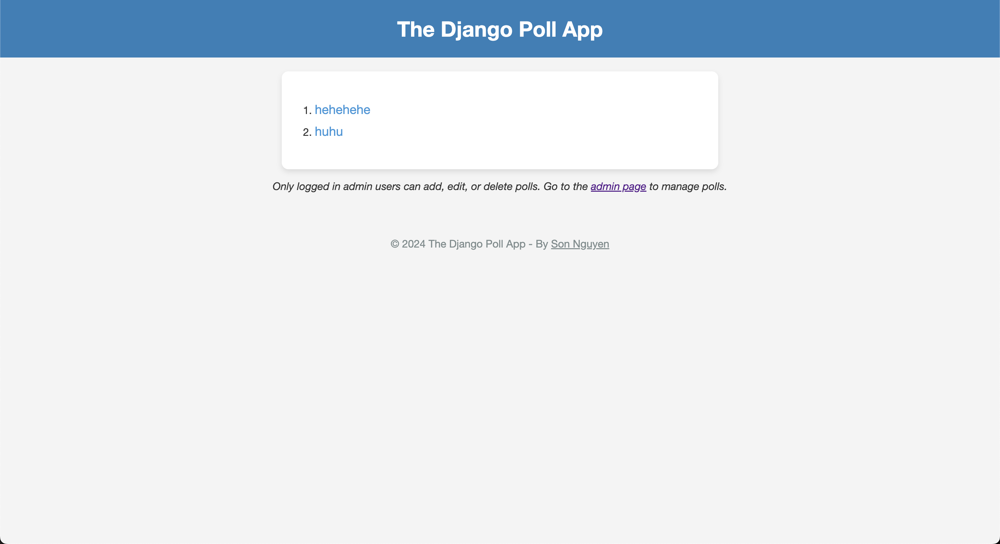
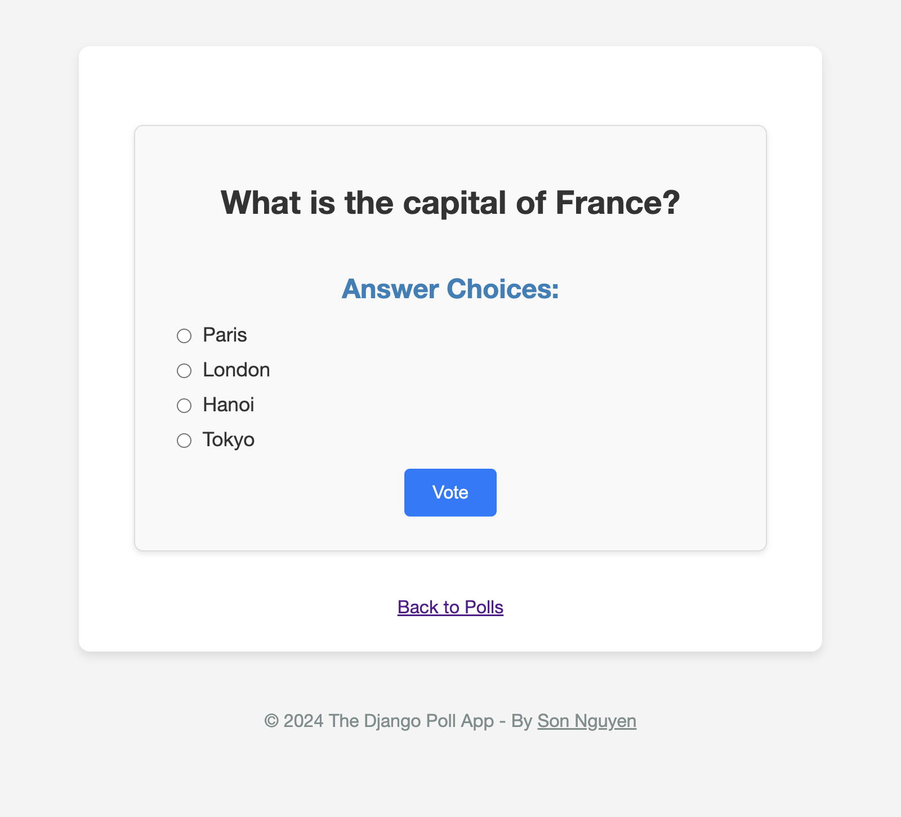
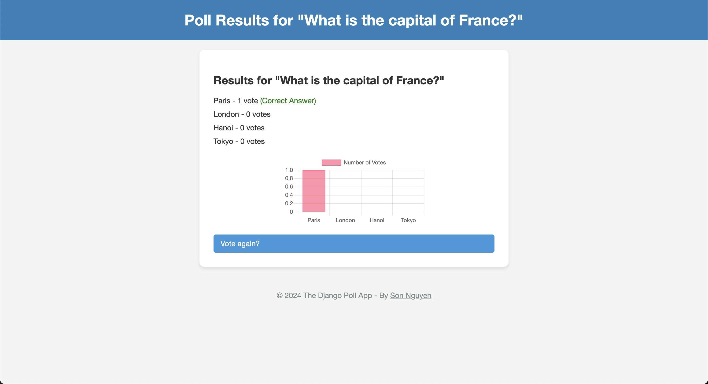
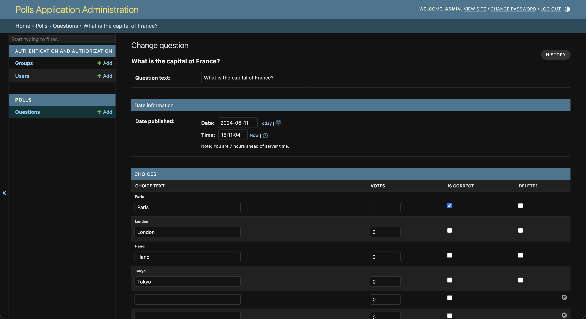
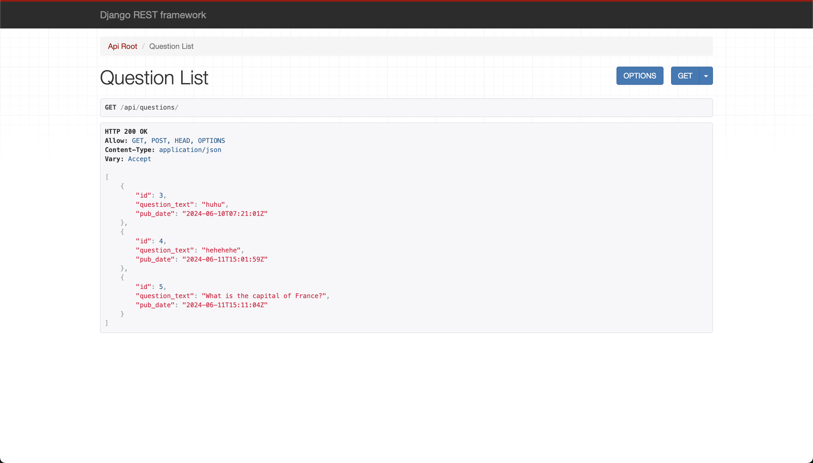

# The Django Poll Application

This repository hosts a poll application that was built with Django, designed to showcase fundamental Django concepts like models, views, templates, and the admin interface.

## Table of Contents
- [User Interface](#user-interface)
- [Features](#features)
- [Technologies Used](#technologies-used)
- [Installation](#installation)
- [Usage](#usage)
- [Project Structure](#project-structure)
- [Customization](#customization)
- [Contributions](#contributions)
- [License](#license)
- [Contact](#contact)

## User Interface

### Homepage

<p align="center" style="cursor: pointer">
    
</p>

### Poll Details

<p align="center" style="cursor: pointer">
    
</p>

### Poll Results

<p align="center" style="cursor: pointer">
    
</p>

### Admin Interface

<p align="center" style="cursor: pointer">
    
</p>

## Features

- **Create Polls:** Admin users can easily create questions and add multiple answer choices.
- **Vote:**  Users can view available polls and vote for their preferred choices.
- **Results:** Real-time results are displayed after voting, showing the distribution of votes.
- **Admin Dashboard:**  A robust admin interface allows for managing questions, choices, and viewing results.
- **Correct Answers:** Admin users can specify correct answers for each question, and users see if they voted correctly on the results page.
- **Homepage and Navigation:** Clear navigation between the homepage (list of polls), poll details, and results.
- **Basic Styling:**  Includes basic CSS styles for a clean and visually appealing presentation.

## Technologies Used

- **Django:** Web framework for rapid development.
- **Python:** The programming language used for the backend logic.
- **HTML/CSS:**  For structuring and styling the user interface.
- **JavaScript (Optional):** Used for adding interactivity (e.g., Chart.js in your `results.html`).

## Installation

1. **Clone the Repository:** Clone the repository using the Code button in the repository's main GitHub page.

2. **Create a Virtual Environment:**
   ```bash
   python -m venv .venv
   ```

3. **Activate the Virtual Environment:**
   ```bash
   source .venv/bin/activate  # Linux/macOS
   .\venv\Scripts\activate    # Windows
   ```

4. **Run Migrations:**
   ```bash
   python manage.py makemigrations
   python manage.py migrate
   ```

5. **Create Admin User:**
   ```bash
   python manage.py createsuperuser
   ```

6. **Start the Server:**
   ```bash
   python manage.py runserver
   ```
   
**Important**: Remember to change the Django production secret key and set `DEBUG` to `True` in `PollApplication/settings.py` order to run the server:
```python
SECRET_KEY = 'your_secret_key'

DEBUG = True
```

## Usage

1. **Access the Admin Interface:** Go to `http://127.0.0.1:8000/admin/` and log in with your superuser credentials.
2. **Create Polls:**
    - Click "Polls" or "Questions" in the admin interface.
    - Click "Add Question" and fill out the question text and publication date.
    - Click "Save and continue editing" to add answer choices.
    - Mark the correct answer using the checkbox.
3. **View Polls:** Visit the homepage (`http://127.0.0.1:8000/polls/`) to see the list of available polls.
4. **Vote:** Click on a poll to view details and select your answer.
5. **View Results:** After voting, you'll be redirected to the results page, where you can see the vote distribution and whether you answered correctly.

## Project Structure

- **`polls/`:**
    - `models.py`: Defines the `Question` and `Choice` models.
    - `views.py`: Contains the views for displaying polls, voting, and showing results.
    - `admin.py`: Customizes the Django admin for poll management.
    - `urls.py`: Defines the URL patterns for the poll app.
    - `tests.py`: Contains test cases for the app.
    - `__init__.py`: Makes the directory a Python package.
    - `apps.py`: Configuration for the app.
    - `templates/polls/`: Contains the HTML templates for the app's views.
      - `index.html`: Homepage with a list of polls.
      - `detail.html`: Poll details and voting form.
      - `results.html`: Poll results with vote distribution.
    - `static/`: (Optional) Stores static files like CSS for styling.
      - `images/`: Contains images used in the app.
      - `polls/style.css`: CSS file for styling the app.
    - `migrations/`: Contains database migration files.
- **`PollApplication/`:**
    - `settings.py`: Contains the project settings and configurations.
    - `urls.py`: Defines the URL patterns for the entire project.
    - `wsgi.py`: WSGI configuration for deployment.
    - `asgi.py`: ASGI configuration for deployment.
    - `__init__.py`: Makes the directory a Python package.
- **`db.sqlite3`:** The default SQLite database file.
- **`manage.py`:** A command-line utility for interacting with the project.

## Customization

- **Templates:** Modify the HTML templates (`index.html`, `detail.html`, `results.html`) to customize the look and feel of the poll pages.
- **Styling:** Add more CSS rules to `style.css` or create new stylesheets for further customization.
- **Functionality:** Extend the models or views to add more features like user authentication, poll comments, or social media sharing.

## REST API Usage

This app also includes a REST API built with Django REST Framework (DRF). Here are the available endpoints:

| Endpoint               |        Methods         | Description                                 | Authentication Required |
|:-----------------------|:----------------------:|:--------------------------------------------|:-----------------------:|
| `/api/questions/`      | GET, POST, PUT, DELETE | List/create/update/delete questions.        |            ✅            |
| `/api/questions/<id>/` |    GET, PUT, DELETE    | Retrieve/update/delete a specific question. |            ✅            |
| `/api/choices/`        | GET, POST, PUT, DELETE | List/create/update/delete choices.          |            ✅            |
| `/api/choices/<id>/`   |    GET, PUT, DELETE    | Retrieve/update/delete a specific choice.   |            ✅            |

**Example Usage (with curl):**

```bash
# Get all questions
curl http://127.0.0.1:8000/api/questions/

# Get a specific question
curl http://127.0.0.1:8000/api/questions/1/
```

For example, if you run `curl http://127.0.0.1:8000/api/questions/`, you will get this output: 

```json
[{"id":3,"question_text":"huhu","pub_date":"2024-06-10T07:21:01Z"},{"id":4,"question_text":"hehehehe","pub_date":"2024-06-11T15:01:59Z"},{"id":5,"question_text":"What is the capital of France?","pub_date":"2024-06-11T15:11:04Z"}]
```

You can also directly visit the API endpoints in your browser: 

<p align="center" style="cursor: pointer">
    
</p>

**Authentication:**
To use POST, PUT, or DELETE methods, you'll need a valid token, typically obtained after user login. Include this token in the Authorization header:
  
```bash
curl -X POST -H "Authorization: Token <your_token>" -H "Content-Type: application/json" -d '{"question_text": "Is this a new question?", "pub_date": "2023-12-12T12:00:00Z"}' http://127.0.0.1:8000/api/questions/
```

## Contributions

Contributions are welcome! Feel free to open issues or submit pull requests. Feel free to also fork and customize this repo to fit your needs.

## License

This project is licensed under the [MIT License](LICENSE.md). 

## Contact

If you have any questions about this project or Django (or even the Django REST Framework) in general, feel free to [contact me](mailto:info@movie-verse.com)! I'll be happy to answer any questions you might have (hopefully I'll know the answers to them...)

---

Thank you for visiting!